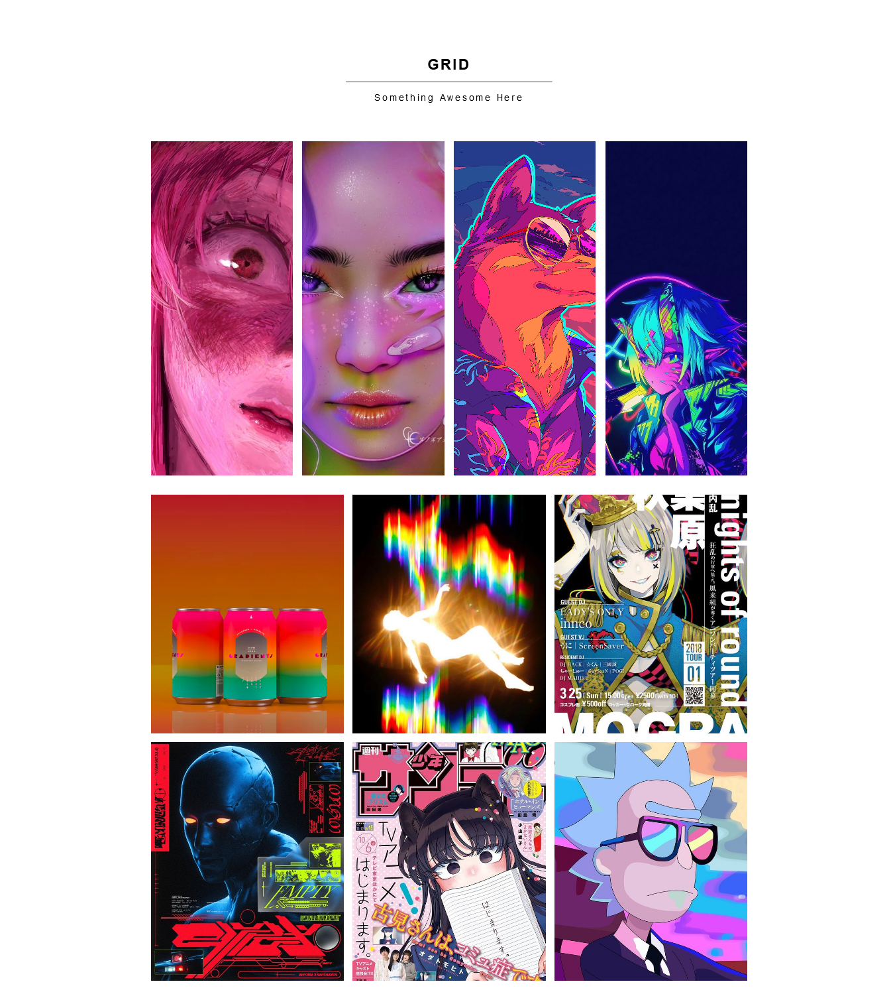
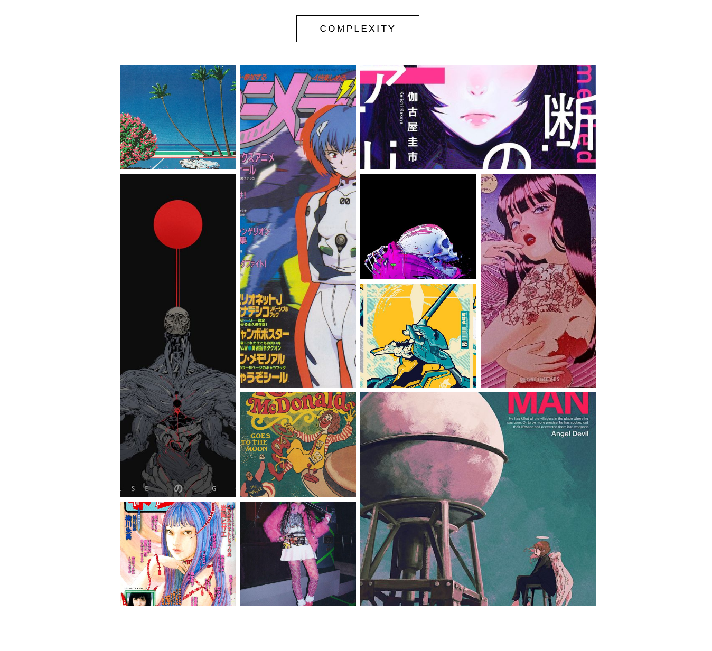

# crap-portfolio

This is my peronsal portfolio on UI Web Design using Vanilla CSS and HTML, this project was created for my own personal interest and hobby on designing websites. The concept of mobile-first CSS and CSS utility classes are implemented in this portfolio project. More designs and personalization will be done asa time goes for this project, please look forward to it! 

## Sites
Live site to the portfolio: [https://hanz02.github.io/crap-portfolio/](https://hanz02.github.io/crap-portfolio/)

## Portfolio Sections
- Grid Design
  - V1 Section
  
  
  - V2 Section "Complexity"
  
